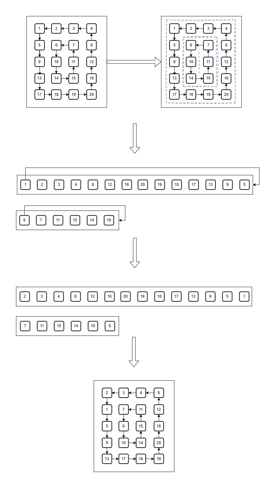

# Matrix Rotation

## What

This is a Java-based solution for the [Matrix Layer Rotation](https://www.hackerrank.com/challenges/matrix-rotation-algo/problem) challenge from HackerRank. The goal of the task is to rotate a given matrix counter-clockwise. You can find the main implementation file in the [MatrixRotator.java](./src/main/java/com/knidarkness/MatrixRotator.java), while the test cases used during the TDD-based approach live in [MatrixRotatorTest.java](./src/test/java/com/knidarkness/MatrixRotatorTest.java).

### Constraints

Some of the important constraints are:

- `2 <= m, n <= 300`, where `m, n` are the matrix dimensions
- `1 <= r <= 10^9`, where `r` is the amount of rotation "steps"
- `min(m, n) % 2 = 0`
- Maximum value of each matrix element is `10^8`

## How & Why

The goal of the task is to rotate a given matrix counter-clockwise.

### Assumptions

- Maximum amount of steps a matrix can be rotated before it becomes the initial matrix equals `(m + (n - 1)) * 2`, which is always less than `10^9`
- Java integer can hold a value of up to 2^31, so we don't need to use any Long/BigInt datatypes
- The HackerRank implementation template suggests using `List<List<Integer>>` as a structure to store a matrix. ~~While `int[][]` would be marginally faster, I believe its importance is negligible on our data volume of `<= 10 000` elements.~~ After some though, I changed the matrix to be int[][] since they are known-size and have no reason to be lists. Individual rings though are kept as Lists for a cheap "shift" operation.
- It is guaranteed that we can rotate matrix and all elements will move because of `min(m, n) % 2 = 0` constraint -- there will not be a static part middle row or column which is not affected by rotation.

With these assumptions in mind, let's take a look at approach we can use to implement the rotation.

On one hand, we could implement some sort of "brute-force simulation" -- create a new matrix, and then for each element of the matrix try to simulate the final position by "rotating" shifting element and changing the direction of shift when we encounter a "wall" (i.e. outer boundary of matrix or row/column). However, implementing this approach would likely be quite cumbersome, hard to read, and computationally not very effective.

Instead, we treat our matrix not as collection of rows (or columns), but rather as a set of nested rings (or layers), each defined by the shortest distance to the matrix's edge (see picture below). In this case, we rotate the matrix by rotating each individual ring. By rotating each ring individually, we not only simplify the rotation process into a straightforward list/array shift, but we can also optimize it by reducing extra rotations (i.e., rotations beyond a full cycle) on a per-ring basis. The more specific steps are:

- Split matrix into the nested rings
- For each ring define needed shift based on `r % len(ring)`
- Shift each individual ring left by the value of previous step
- Re-build a matrix from the shifted rings

Below is the picture illustrating this flow if we need to rotate a matrix by 1 step:

> ### **Change**
> Initial implementation was naively following they laid out approach by explicitly storing each individual ring, shifting it and "assembling" matrix back. However, after some thought I did not like the fact that extra copying was done into the ring-structures & the whole "into ring -> shift -> into matrix" process was explicit. As an experiment, I have then updated the algorithm to use this ring-based logic while without creating explicit ring data-structures.
>
> The complexity is still linear related to total amount of input "cells" (i.e. `O(n*m)`), but with this approach we don't need to copy elements in "extra steps".
>
> All-in-all, while here we save some extra memory & reduce the "constant multiplier" in our `O(n*m)`, unless the performance is absolutely crucial -- I think explicit way is more readable and maintainable.

As for the algorithmic complexity of this approach, we are looking at O(n^2) if `n = m = 300` (or (n x m) otherwise) -- in fact this is linear w.r.t. amount of individual matrix cells we rotate. The extra memory needed grows linearly with the amount of elements of the matrix being rotated as well. 

## Done

And with this, we successfully solved the challenge:
